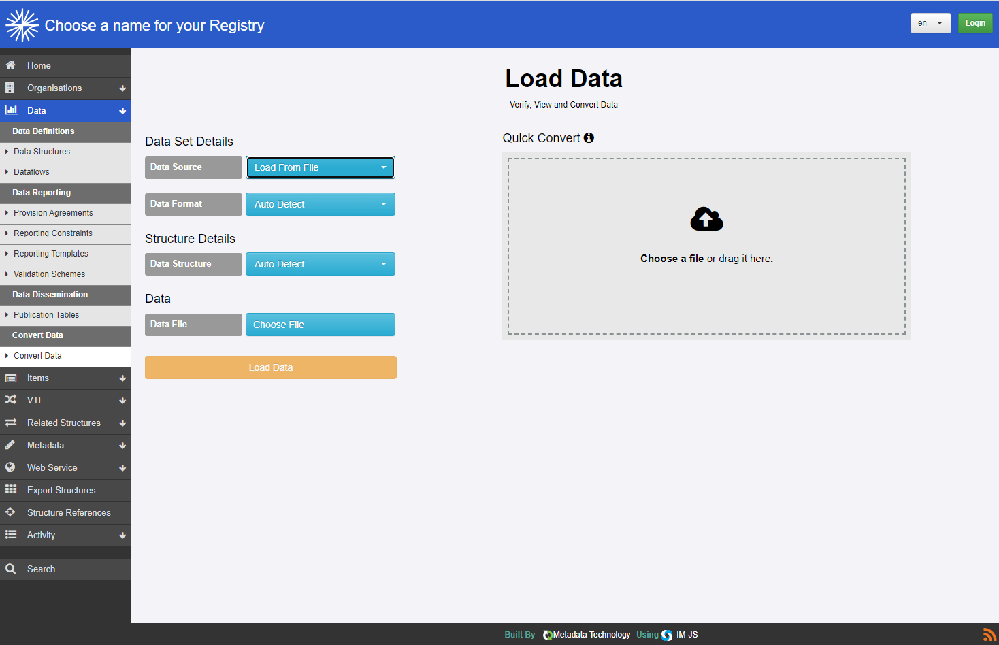
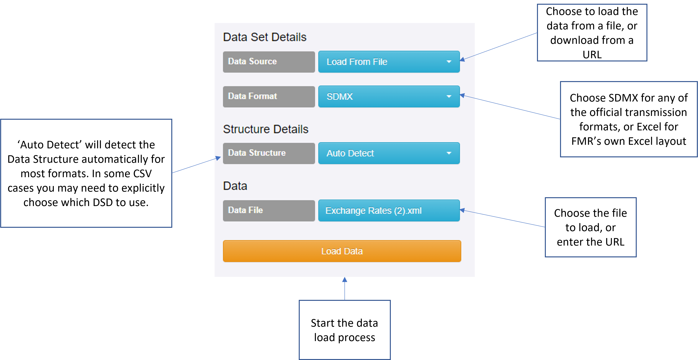
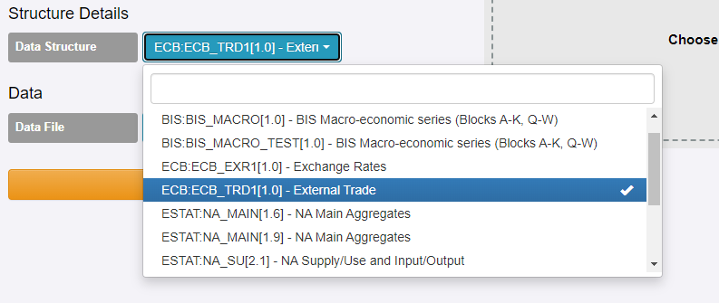
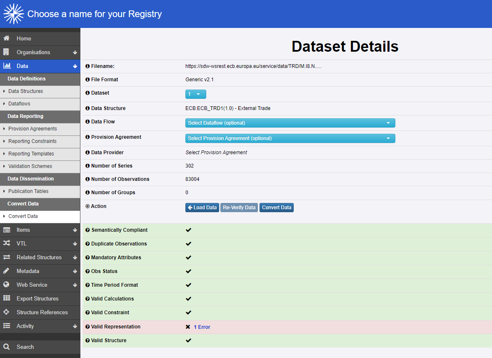
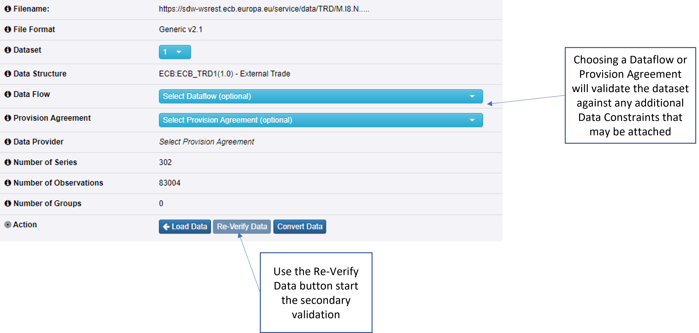
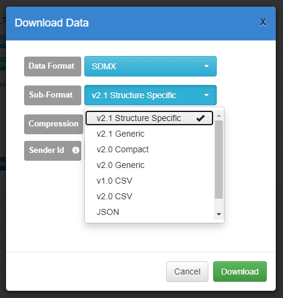

+++
title = "Unit 07 Interactive data conversion using the FMR user interface"
description = "Unit 07 Interactive data conversion using the FMR user interface"
date = "2022-09-29T00:00:00+00:00"
weight = 7
hidden = false
+++

# Introduction
SDMX datasets can be converted interactively between transmission formats using the **Convert Data** function in FMR's web user interface.

</img>

# The interactive data conversion workflow
Conversion of an SDMX dataset follows a defined worflow that starts with loading the data from either a file or a URL.

## Load data
{}
flowchart LR
    0((Convert Data option on menu )) --> A
    A(Load data) --> B(Validate data)
    style A fill:#f9f,stroke:#333,stroke-width:4px
    B --> C{Map data?}
    C -->|no| D(Download data in selected format)
    C -->|yes| E(Choose mapping)
    E --> F(Download data in selected structure and format)
{}
The source dataset can be in any of the transmission formats that we saw in the previous modules: XML, JSON, CSV, EDI and FMR's own Excel layout.

</img>

**Data Source**\
Start by choosing where to load the data from.
- File: an XML, JSON, CSV, EDI or Excel file on disk
- URL: a URL which can be either be a static SDMX dataset on a web server, or an SDMX REST API data query for instance https://sdw-wsrest.ecb.europa.eu/service/data/EXR/M..EUR.SP00.A  

The **Data Format**\
The Data Format defaults to **SDMX** which refers to any of the standard SDMX transmission formats previously discussed.\
Choose **Excel** for FMR's own Excel format.\
**CSV** can be used when loading CSV data that is not in the standard SDMX format.

**Data Structure**\
FMR will automatically detect the source dataset's DSD for all SDMX formats and FMR Excel.

You will need to explicitly choose the DSD, only when working with CSV that does not have columns for the Dataflow, DSD or Provision Agreement. Clicking the Data Structure dropdown reveals a list of all DSD's in your FMR's structural metadata registry from which to pick.

</img>

{}FMR must hold a copy of the Data Structure Definition (DSD) for the dataset being loaded - the DSD is needed to interpret and validate the source data. 
  If the DSD is missing FMR will report a **Bad Reference** error explaining that the dataset being loaded references an unknown structure. Resolve the problem by loading or manually creating the DSD in FMR.{}

**Data File** or **Data URL**\
Choose the file to load.
- Click on the blue box to select the file using File Explorer (Windows) or Finder (Mac)
- Drag and drop the file onto the blue box

## Validate data
{}
flowchart LR
    style B fill:#f9f,stroke:#333,stroke-width:4px
    0((Convert Data option on menu )) --> A
    A(Load data) --> B(Validate data)
    B --> C{Map data?}
    C -->|no| D(Download data in selected format)
    C -->|yes| E(Choose mapping)
    E --> F(Download data in selected structure and format)
{}

FMR automatically validates the dataset agaist the DSD as soon as it is loaded. 

Nine separate validation rules are applied and a report is returned showing whether each rule has passed or failed. In the example below, a **representation error** has been detected because the dataset contains a code that is not in FMR's copy of the relevant Codelist.

</img>

{}
1. Goto the FMR cloud sandbox Load Data Page: https://fmr.sdmxcloud.org/FusionRegistry/data/load/data-load.html
2. Select **Load From URL** for the data source
3. Copy the following URL which is a selection from the ECB's External Trade dataset in SDMX-ML 2.1 Generic format:  https://sdw-wsrest.ecb.europa.eu/service/data/TRD/M.I8.N.....UVX
4. Past the URL into **Data URL** box and click **Load Data**
{}

**Validation agaist Dataflow and Provision Agreement Data Constraints**\
Loaded data can be further validated against a **Dataflow** or **Provision Agreement**. This secondaray validation checks whether the dataset complies with any additional **Data Constraints** that may be attached to the Dataflow, Provision Agreement or both.

</img>

## Map data
{}
flowchart LR
    style C fill:#f9f,stroke:#333,stroke-width:4px
    style E fill:#f9f,stroke:#333,stroke-width:4px
    0((Convert Data option on menu )) --> A
    A(Load data) --> B(Validate data)
    B --> C{Map data?}
    C -->|no| D(Download data in selected format)
    C -->|yes| E(Choose mapping)
    E --> F(Download data in selected structure and format)
{}

FMR's data conversion function optionally allows loaded datasets to be transformed to different DSDs if the necessary **SDMX Structure Maps** have been defined. Click **Convert Data** and select the required Structure Map from the list provided on the **Download Data** popup window. 

{}SDMX Structure Mapping will not be explored further here, but is covered in detail in other modules.{}

## Download data in the selected format
{}
flowchart LR
    style D fill:#f9f,stroke:#333,stroke-width:4px
    style F fill:#f9f,stroke:#333,stroke-width:4px
    0((Convert Data option on menu )) --> A
    A(Load data) --> B(Validate data)
    B --> C{Map data?}
    C -->|no| D(Download data in selected format)
    C -->|yes| E(Choose mapping)
    E --> F(Download data in selected structure and format)
{}

Click the **Convert Data** button to complete the conversion process by downloading the loaded dataset in the required transmission format.

</img>

**Data Format** is curently always SDMX. Other non-SDMX transmission formats such as Excel or XBRL may be supported in future versions of FMR.

{}Note the Excel is not supported as an export format{}

Choose the SDMX format from the **Sub-Format** list.

**Compression**
The final dataset can be optionally compressed as a Zip file.

**Sender Id**
For some data formats (e.g. SDMX-ML or SDMX-EDI) the header section contains the sender id. This field can be used to set the value the sender id will take.

## Tips and points to note
{}
FMR will often allow datasets to be converted and downloaded in the required format despite validation errors being reported. Only critical errors such as structural mismatch between the loaded dataset and the DSD will block conversion.

Consider using the **Compression** option when converting to more verbose formats such as SDMX-ML (XML).

Loaded datasets are held in temporary storage for up to 15 minutes before being discarded. You'll need to re-load the data if the converson and download process is not completed within that time.

{}

## Recap
- SDMX datasets can be converted interactively between transmission formats using the Convert Data function that can be found in the web user interfaces menu bar.
- Datasets can be loaded from file or directly from a URL.
- FMR automatically validates loaded a loaded dataset against its DSD copy of which must already be present in FMR's structural metadata repository.
- Loaded datasets can also be optionally validated against a Dataflow or Provision Agreement to check for compliance with any additional Data Constraints.
- Loaded datasets can be optionally mapped to different DSDs provided the necessary SDMX Structure Maps are in plance, and downloaded in any of the standard SDMX formats

## In the next unit
In the next unit we'll look briefly at FMR's SDMX-ML 2.1 structure specific ‘quick convert’ function