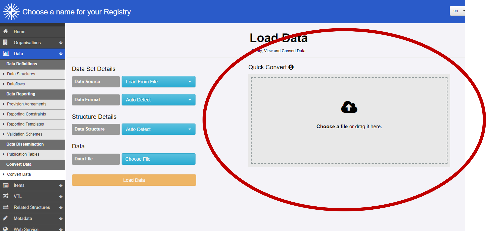
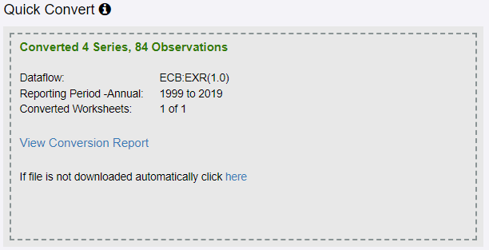
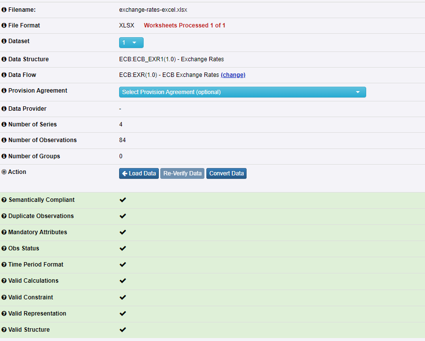

+++
title = "Unit 08 Quick convert function"
description = "Unit 08 Quick convert function"
date = "2022-10-04T00:00:00+00:00"
weight = 8
hidden = false
+++

# Introduction
FMR's **quick convert** function provides a quick way to interactively convert datasets in SDMX and FMR Excel formats to **SDMX-ML 2.1 Structure Specific**.

</img>

# Drag or choose a file to convert
{}
flowchart LR
    style A fill:#f9f,stroke:#333,stroke-width:4px
    style B fill:#f9f,stroke:#333,stroke-width:4px
    0((Convert Data option on menu )) --> A
    0 --> B
    A(Drag file) --> C(Automatic convert and download)
    B(Choose file) --> C
    C -..->|optional| D(View validation report)
 
{}

Either drag a file onto the **Quick Convert** box, or click **Choose a file** and select from disk.

# Automatic convert
{}
flowchart LR
    style C fill:#f9f,stroke:#333,stroke-width:4px
    0((Convert Data option on menu )) --> A
    0 --> B
    A(Drag file) --> C(Automatic convert and download)
    B(Choose file) --> C
    C -..->|optional| D(View validation report)
 
{}

FMR automatically converts the file to SDMX-ML 2.1 Structure Specific unless critical validation errors prevent it.

The resulting XML file is automatically downloaded, or can be retrieved by clicking on the link provided.

A conversion summary is shown. In the example below, an Excel workbook with ECB Exchange Rates data has been submitted for conversion.

</img>

{}

# Validation report
{}
flowchart LR
    style D fill:#f9f,stroke:#333,stroke-width:4px
    0((Convert Data option on menu )) --> A
    0 --> B
    A(Drag file) --> C(Automatic convert and download)
    B(Choose file) --> C
    C -..->|optional| D(View validation report)
 
{}

You can view the validation report if needed by clicking on the **View Conversion Report** link provided.

</img>

# Recap
- Quickly convert SDMX datasets in any of the standard formats or FMR Excel to SDMX-ML 2.1 Structure Specific by dragging the file onto the Quick Convert box

# In the next unit
The next and final unit in this module introduces FMR's **transform** REST API method for automating converstion of SDMX datasets