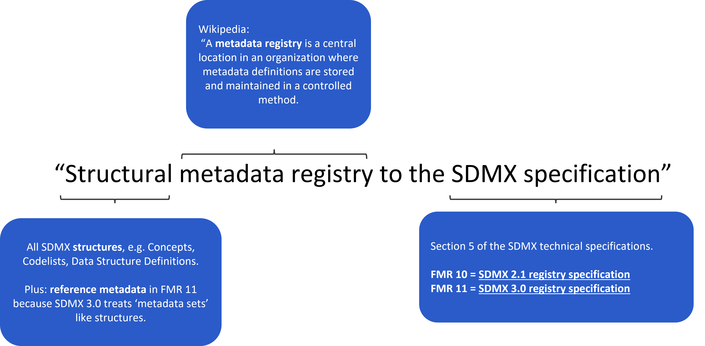

+++
title = "Unit 01 About structural metadata and 'metadata registries'"
description = ""
date = "2022-08-16T18:36:24+02:00"
tags = ["Docker"]
weight = 1
hidden = false
+++

</img>

## What is a 'metadata registry'?
[Wikipedia](https://en.wikipedia.org/wiki/Metadata_registry) tells us that a metadata registry is a central location in an organisation where metadata definitions are stored and maintained in a controlled method.

A metadata registry can therefore be thought of as a **database for metadata**.

## About 'structural metadata'
Fusion Metadata Registry focuses principally on **structural metadata**.

In SDMX, structural metadata are the Concepts, Codelists, Data Structure Definitions (DSDs) and other artefacts that together can be used for modelling statistical data domains.

Structural metadata is often referred to simply as 'structures', and we'll use that terminology in this module.

From FMR 11, **reference metadata** can also be stored because SDMX 3.0 treats reference metadata sets (also called reference metadata reports) as structural metadata objects.

## FMR implements the SDMX Registry specification
Section 5 of the SDMX technical specifications sets out precisely what functions a metadata registry should perform and the interfaces it provides. Fusion Metadata Registry is designed to these specifications meaning that it should work with other SDMX software tools and systems.

In particular, the FMR enables:
- the submission (storage);
- maintenance (update);
- retrieval of structures. 

It supports most of the SDMX standard structural metadata transmission formats including:

- SDMX-ML - XML
- SDMX-JSON - JSON
- EDI

Structures can therefore be easily exchanged with other organisations and used with other SDMX software tools that also accept the standard transmission formats.
