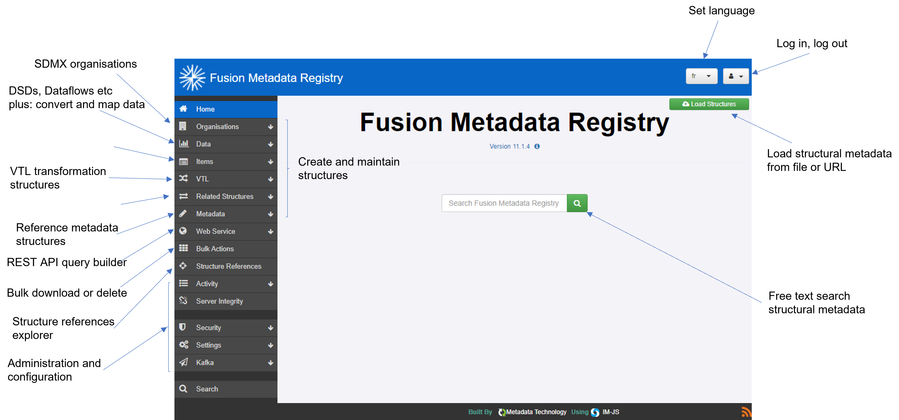

+++
title = "Unit 02 What is FMR?"
description = ""
date = "2022-08-10T18:36:24+02:00"
tags = ["Docker"]
weight= 2
hidden = false
+++

## FMR uses the SDMX 3.0 information model
FMR 11 uses the SDMX 3.0 information model internally for storing and organising the structural metadata it holds.  

We'll look at the SDMX 3.0 information model in more detail in the next module, but for now the key point is that FMR 11 is able to natively work with the structures as defined in SDMX 3.0.

SDMX 2.1 structures are supported for backward compatibility where possible. Fortunately most are fully compatible with SDMX 3.0 meaning that they can be stored in and retrieved from FMR 11. 

However, there are two SDMX 2.1 structures that are not directly supported by SDMX 3.0:

Structure Set - this has been replaced by Structure Maps
Hierarchical Codelist - replaced by Hierarchy
In these two cases, SDMX 2.1 structures will be converted to their SDMX 3.0 equivalent on load into the Registry. The transformation is one-way meaning that, once loaded, the original SDMX 2.1 structures cannot be recreated.

## FMR will also validate, transform (map) and convert SDMX datasets
In addition to its core role storing structural metadata, FMR also provides three data processing services:

### Data validation

FMR will validate loaded datasets by applying nine quality rules which include:

checking that the data matches the Data Structure Definition
the 'representation' is correct - generally that the codes in the data are in the relevant Codelists
the data complies with any defined 'constraints' - a constraint for instance may be defined to limit the regions a specific data provider can report data for
all mandatory attributes are included in the data
'balance equalities' - any observations between series that should be consistent with one another as is often the case with financial data

### Data transformation / mapping

In the SDMX 3.0 information model,  Structure Maps can be used to define the transformation of data from one Data Structure Definition to another. Typical use cases include transforming data received to the structure needed for internal processing, and transforming internal datasets to a simpler structure better suited to public publication.

Using FMR, a Structure Map can be created and tested and used to actually transform datasets to the new structure.

### Data conversion

FMR will convert datasets between the SDMX data transmission formats. For instance, data loaded in SDMX-CSV can be converted to SDMX-ML (XML), SDMX-JSON or EDI.

It's also possible to load data from Excel workbooks - but the worksheet containing the data must use a layout that is specific to FMR.

## SDMX REST Application Programming Interface (API) in FMR
FMR implements the SDMX standard REST application programming interface (API) for:

Structure queries
Structure specific schemas
SDMX has two versions of the REST API:

Version 1 of the REST API accompanied SDMX 2.1

Version 2 of the REST API accompanies SDMX 3.0

FMR 11 supports support version 2, and also version 1 for backward compatibility.

Details of the SDMX REST APIs are out of scope for this course, but it may be helpful to read the documentation on GitHub:

Version 2 structure query API documentation 

Version 1 structure query API documentation

The schema API generates XML schemas for validating SDMX XML structure specific datasets using generic XML software tools like XML Spy. Again, the detail of this is outside the scope of this course but the documentation provides further reading.

## FMR provides a web user interface
In addition to the REST API, FMR also provides a web user interface.

</img>

A standard web browser (e.g. Chrome, Microsoft Edge, Safari) is all that is needed.

The web user interface provides the following main functions:

- Browse, view and download any of the structures stored in the Registry
- Author new structures
- Maintain and modify existing structures
- Import structures from file or from another SDMX REST API service such as that provided by the SDMX Global Registry
- Process data using the validation, transformation (mapping) and conversion services
- Configure and administer the software

## Recap

- FMR is primarily a structural metadata registry whose main purpose is storage of SDMX structural metadata
- FMR 11 supports the SDMX 3.0 information model but will also work transparently with SDMX 2.1 structures except in the case of Structure Sets and Hierarchical Codelists
- FMR also provides three data processing services: validation, transformation (mapping) and data transmission format conversion
- There are two interfaces:
    - SDMX-compliant REST API for automation
    - Web user interface for interactively working with the Registry's structural metadata content and processing data using its validation, transformation (mapping) and conversion services

## In the next unit

In the next unit we'll look in more detail at the SDMX 3.0 information model, the key structural metadata artefacts and how they relate to one another.
