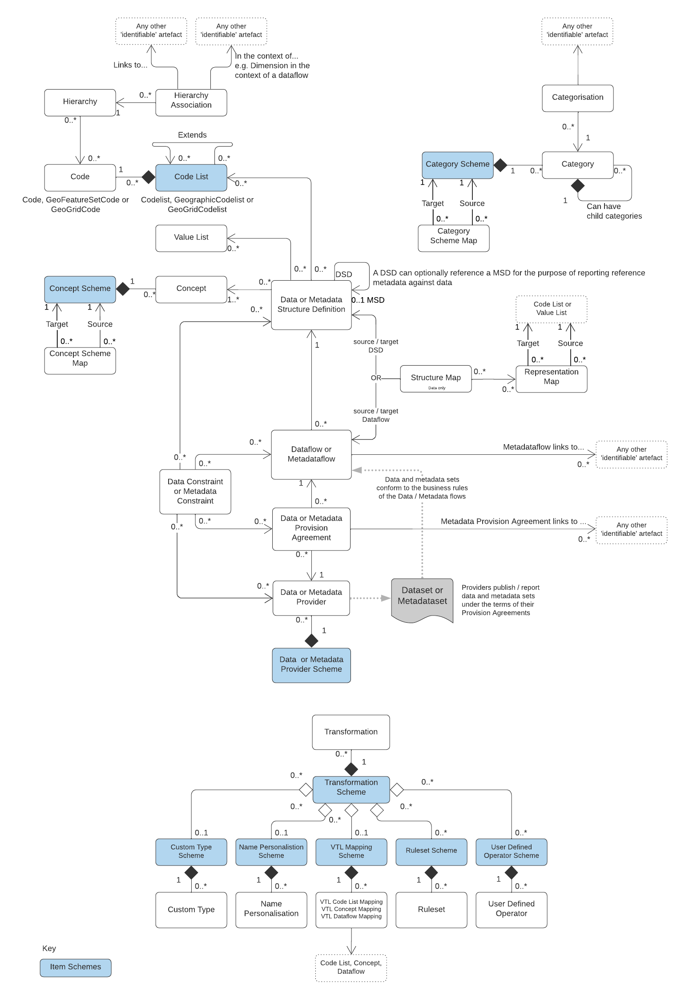
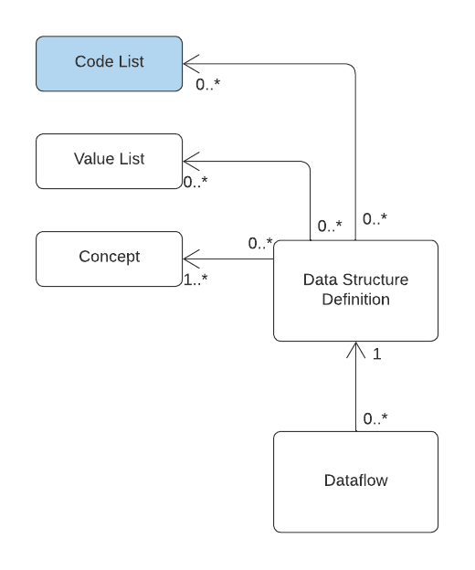
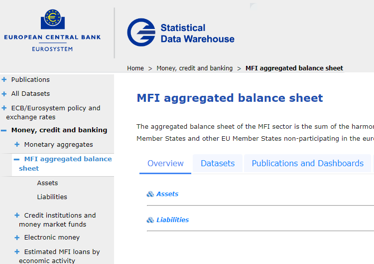

+++
title = "Unit 03 SDMX 3.0 information model fundamentals"
description = ""
date = "2022-08-14T12:30:24+00:00"
tags = ["Docker"]
weight= 3
hidden = "true"
+++

## In this unit
In this unit we'll take a high level look at the SDMX 3.0 information model that underpins Fusion Metadata Registry 11, why it's important and which bits it's worth knowing to help get started with FMR.

## The SDMX 3.0 model overview
The SDMX 3.0 information model has around **34 separate structures** which can be used for modelling data domains, modelling data collection, data discovery and other purposes.

Contrast this to typical [SQL relational database models](https://en.wikipedia.org/wiki/Relational_model) that maybe have four or five structures: table, index, view, key constraint for instance.

The UML schematic below shows a reasonably complete overview of the SDMX 3.0 information model, missing out only Agency Scheme, Process and Reporting Taxonomy to help improve clarity. 

</img>

You can download a <a href="/files/SDMX 3.0 Information Model.pdf">PDF version</a> of the information model schematic for reference.

## Why is the information model important to FMR?
The SDMX 3.0 information model is how FMR structures its metadata internally. A basic knowledge of the key SDMX structures is therefore needed to use the tool effectively.

It's also useful to understand the interdependencies between structures which are illustrated by the arrows and lines in the UML schematics.

</img>

The excerpt above from the SDMX information model shows the Dataflow's immediate dependencies. 

Importantly, it tells us that to create a Dataflow, the information model requires we also need: a Data Structure Definition (DSD) and at least one Concept. 

In practice, DSDs and therefore Dataflows generally need Codelists as well to define the enumeration of their dimensions, attributes and measures. So creation of a Dataflow generally requires the following sequence:

1. Create Codelists for any enumerated Data Structure components.
2. Create all of the required Concepts, referencing the relevant Codelist if enumerated
3. Create the Data Structure Definition referencing the Concepts
4. Create the Dataflow referencing the Data Structure Definition

## FMR enforces the referential integrity of its metadata
FMR records, tracks and rigorously enforces these interdependencies between structures in order to maintain the **referential integrity** of its internal information model.

The model is said to be **referentially correct if the graph of structures** is complete such that no structure referenced by another is missing.

In practice this means two things:

1. As observed in the case of the Dataflow, structures cannot be created unless every structure they depend upon already exists.
2. Deleting a structure requires that all other structures that depend on it must also be deleted.

Attempting to delete a codelist in FMR will often require the deletion of DSDs and Dataflows that depend on it.

Similarly, attempting to load structural metadata from a file will result in rejection if not all references are satisfied.

## Items and item schemes
The structures highlighted in blue in the information model schematics are **items schemes**.

These are containers for **items** including Codes, Concepts, Categories and Data Providers. Items can be individually identified because each has a unique **SDMX Id**. However they cannot be maintained separately and can only exist within their item scheme.

## Key artefacts for data domain modelling
While there are over 30 structures in the complete information model, relatively few need to be used in order to get started with FMR.

The following structures are required for basic data domain modelling:

- Concepts for your data domain (plus a Concept Scheme to hold and organise them)
- Codelist and Codes
- Data Structure Definition

Concept Schemes and their Concepts describe the data domain's core concepts or **represented variables**.

Codelists and Codes are closely related, precisely defining the enumerations for any concepts with **enumerated representation**.

Data Structure Definitions (DSDs) bring it all together describing the structure of the domain's datasets in terms of their **Dimensions**, **Attributes**, and **Measures**, each of which is defined by a Concept.

## Key artefacts for modelling data collection
The following structures are typically used for modelling data collections:

- Data Structure Definition and dependencies
- Dataflow
- Data Constraint
- Provision Agreement
- Data Provider Scheme and Data Providers

While Data Structure Definitions describe a class of datasets all with the same basic structure, **Dataflows** can be thought of as describing a specific dataset. In the Eurosystem, a range of separate Dataflows for National Accounts all use the same <a href="https://registry.sdmx.org/data/datastructure.html?urn=urn:sdmx:org.sdmx.infomodel.datastructure.DataStructure=ESTAT:NA_MAIN(1.13)">ESTAT:NA_MAIN</a> Data Structure Definition.

**Provision Agreements** define which **Data Providers** provide data for a specific Dataflow. For international organisations and others concerned with collecting data from multiple providers, the arrangement if typically modelled using a single Dataflow and multiple Provision Agreements, one for each data provider. A single provision agreement is sufficient for most other use cases where the owner of the Dataflow provides the data.

**Data Constraints** allow the **Valid Universe of Data** to be more closely defined and can be attached at four different levels: 
- Data Structure Definition
- Dataflow
- Data Provider
- Provision Agreement


A typical Data Constraint may constrain a dataset's valid geographical regions. The standard <a href="https://registry.sdmx.org/items/codelist.html?urn=urn:sdmx:org.sdmx.infomodel.codelist.Codelist=SDMX:CL_AREA(2.0)">**SDMX:CL_AREA** codelist</a> for instance lists many regions, but only a few may be relevant. Creating a constraint that limits values to: ````DE````, ````ES```` and ````IT```` ensures that only observations for those regions are valid and helps improve data quality by preventing data beng reported for other regions in error. Attaching that constraint to the Data Structure Definition applies the restricton to all Dataflows that use it. Conversly, attaching it to a specific Provision Agreement enforces the rule only for that particular Data Provider and Dataflow.

## Key artefacts for data discovery
Data discovery concerns the ability of consumers of published statistical data to find the datasets, series and data points they need. The following structures can be used for that purpose:

- Category Scheme and Categories
- Hierarchy 
- Hierarchy Association

For data discovery, **Categories** are typically used to organise Dataflows into an arbitrary tree of topics helping users to find the datasets they need by navigating down from general themes to more specific topics.

The European Central Bank's public Statistical Data Warehouse uses this approach:


</img>


The SDMX 3.0 **Hierarchy** structure replaces Hierarchical Codelists from SDMX 2.1 and serve much the same purpose allowing the definition of arbitrary hierarchy trees of codes, possibly from multiple Codelists. In principle, a software tool for searching an SDMX statistical data warehouse could present these trees as a way for users to search for specific codes. 

As an example, consider a flat codelist of indicators. Creating a Hierarchy could allow the indicators to be organised into a subject-based tree that is more easily searched than a simple flat list.

Finally to Hierarchy Association, this structure was added in SDMX 3.0 to allow Hierarchies to be directly associated with any other 'identifiable' artefact in the information model (an identifiable is anything with an Id which includes Codes and Concepts). A common use case is defining the Hierarchy's context, for example to assign a Hierarchy to a DSD Dimension but only in the context of a specific Dataflow.

## Other artefacts in the SDMX information model                
In concluding this lesson it's worth mentioning the remaining structural metadata artefacts not already covered. Broadly these fit into four categories:

### Reference Metadata

In SDMX 3.0, modelling of Reference Metadata and its collection follows the same approach to that of data with structures for Metadata Structure Definition (MSD), Metadataflow, Metadata Constraint, Metadata Provision Agreement and Metadata Provider which are the direct analogues for the data counterparts.

### Structure Mapping

We learnt in lesson 2 of FMR's data processing services and its function for transforming (or mapping) datasets to a different structure. Those mapping rules are primarily defined by two structures: Structure Map and Representation Map.  The information model also provides two other specialist maps in the form of the Concept Scheme Map and Category Scheme Map structures for mapping Concept Schemes and Category Schemes respectively. These are lesser used in practice.                                                                                                                      

### VTL (Validation and Transformation Language)

A set of six structures make up the 'transformation and expression' part of the information model and are used for structuring VTL programs as SDMX metadata objects such that they can be centralised, controlled and exchanged in the same way as DSDs and Codelists.

### Special-purpose Structures

Two structures fall into this final category: Process and Reporting Taxonomy.  These are typically only used by organisations with specific use cases. For the purposes of this course, it's simply worth noting that they exist.  

## Recap
- An understanding of the SDMX 3.0 information model is important to using FMR effectively because it describes how the metadata organised
- While the complete model has around 34 structures,  around 10 are needed to cover the majority of common data-related use cases:
    - Concept
    - Codelist
    - Data Structure    
    - Dataflow
    - Provision Agreement
    - Data Provider
    - Data Constraint
    - Hierarchy
    - Hierarchy Association
    - Category Scheme  
    
## In the next unit
In the next unit we'll look at how to get a running FMR installation using the self-contained Docker image.
