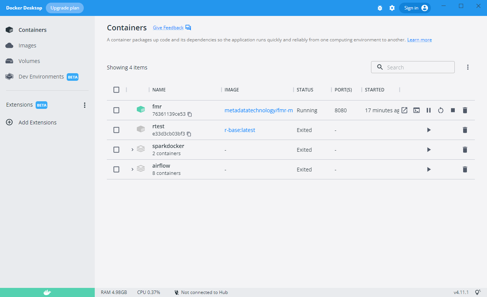

+++
title = "Unit 04 What is Docker"
description = ""
date = "2022-08-14T00:00:00+00:00"
tags = ["Docker"]
weight= 4
hidden = "true"
+++

{}
Skip this unit if you already understand the principles of Docker and containerisation.
{}

## In this unit
In this lesson we'll introduce just enough about Docker and the principles of 'containerisation' in order to use it for running Fusion Metadata Registry.

## What is Docker?
Docker is a software platform for building and running applications in **containers**.

Containers are executable collections of software in which application code is packaged, along with its libraries and dependencies so that it can be run anywhere, whether it be on desktop, traditional IT, or the cloud. 

Docker describes a container as:

"A container packages up code and its dependencies so the application runs quickly and reliably from one computing environment to another."

Containers offer two key advantages for running FMR:

1. All of the software components needed to run FMR are assembled, configured and pre-packaged meaning that the user simply needs to start the container to get a fully functioning installation.
2. Containers can be run on any operating system that supports Docker - Windows, Linux, Apple Mac. There are also cloud services such as <a href="https://cloud.google.com/run/docs/overview/what-is-cloud-run">Google Cloud Run</a> and <a href="https://docs.microsoft.com/en-us/learn/modules/run-docker-with-azure-container-instances/">Microsoft Azure</a>.

For this module, we'll focus on running FMR on a desktop PC or laptop using Docker Desktop.

## Containers and images
An image is template from which containers can be created.

Starting from the FMR image, multiple separate containers can be created if needed each with their own isolated FMR installation complete with its own configuration and metadata content. 

</img>

## The Docker Hub image repository
Docker Images are stored and can be retrieved from an **image repository**.

<a href="https://hub.docker.com/">**Docker Hub**</a> is the main image repository and is where the FMR images are stored.

As we'll see later, Docker provides commands to 'pull' images from Docker Hub

## Running Docker using Docker Desktop
For personal and light production use, **Docker Desktop** provides a simple way to run containers on desktop PCs and laptops. It is free to use for small businesses and non-commercial applications.

Docker Desktop has both a **command line interface**:

</img>

and a graphical user interface:

</img>

## Recap
- Docker is a way to run applications like FMR in containers
- The FMR image is pre-configured with everything needed for a complete running installation
- The FMR image is a template from which multiple containers can be created if needed
- Docker Desktop is the simplest way to run FMR containers on desktop PCs and laptops

## In the next lesson
In the next lesson we'll look at how to install and operate Docker Desktop.