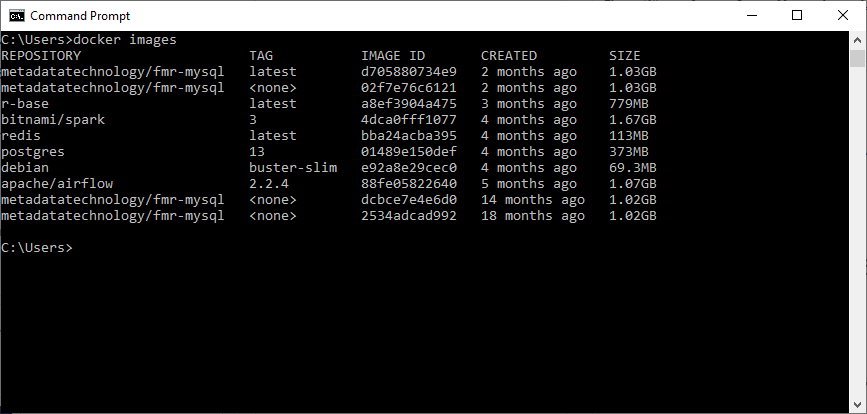
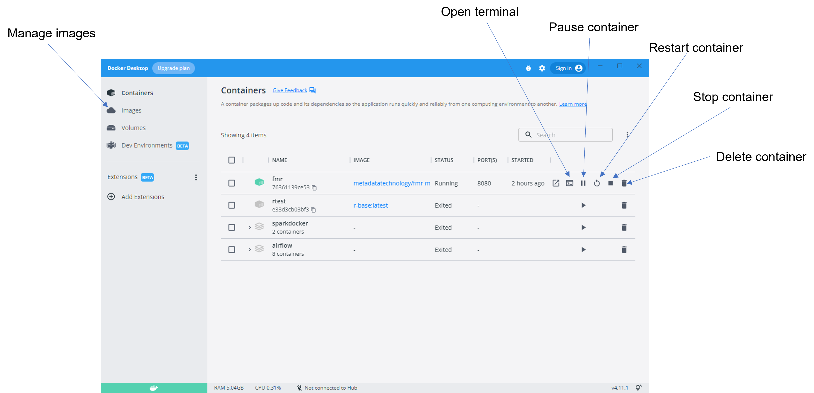

+++
title = "Unit 05 Install and operate Docker Desktop"
description = ""
date = "2022-08-14T00:00:00+00:00"
tags = ["Docker"]
weight= 5
hidden = false
+++

{}
Skip this unit if you already understand how to use Docker Desktop.
{}

## In this unit
In this unit we'll learn how to install Docker Desktop and basic operations.

## Get Docker Desktop
The machine will need at least 4GB of memory.

### On Windows

1. Double-click **Docker Desktop Installer.exe** to run the installer.
<br>Download the installer from <a href="https://hub.docker.com/editions/community/docker-ce-desktop-windows/">Docker Hub</a>. 
<br>It typically downloads to your Downloads folder, or you can run it from the recent downloads bar at the bottom of your web browser.

2. When prompted, ensure the **Use WSL 2 instead of Hyper-V** option on the Configuration page is selected or not depending on your choice of backend.
<br>If your system only supports one of the two options, you will not be able to select which backend to use.

3. Follow the instructions on the installation wizard to authorize the installer and proceed with the install.

4. When the installation is successful, click **Close** to complete the installation process.

5. If your admin account is different to your user account, you must add the user to the **docker-users** group. Run **Computer Management** as an **administrator** and navigate to **Local Users and Groups > Groups > docker-users**. Right-click to add the user to the group. Log out and log back in for the changes to take effect.

The Docker documentation has additional details: https://docs.docker.com/desktop/install/windows-install/ 

### On Mac

For Macs with Intel chips, note that macOS must be version 10.15 or newer.

1. Double-click Docker.dmg to open the installer, then drag the Docker icon to the Applications folder.
<br>Download the installer from Docker Hub.  

2. Double-click Docker.app in the Applications folder to start Docker Desktop.

## Using the Docker command line interface
The task of pulling images from the Docker Hub repository and creating containers is best done using the **Docker Command Line Interface**.

Start by opening a **command prompt window...**

In Windows you can use either:
- Command Prompt
- Powershell

On Macs, use the Terminal app.

Everything is done using the docker command. In the following Windows example, the docker images command returns a list of images that have been pulled into the local Docker Desktop.

</img>

The following Docker commands are the most useful when working with the containerised FMR:

| Docker command | Action |
|-----------------------------|---------------------------------------------------------------------|
|````docker pull [image name]````| Pull the named image from Docker Hub downloading it to the local machine|
|````docker container create [container details]````|Create a container from a pulled image|
|````docker start [container name]````|Start the named container|docker stop [container name]|
|````docker stop [container name]````|Stop the named container|
|````docker images````|List the pulled Docker images|
|````docker ps````|List the active containers|
|````docker ps -a````|List all containers including those that are inactive|

## Working with the Docker Desktop user interface
The Docker Desktop graphical user interface provides an alternative way to view and manage containers and images. 

You'll find it easier to use the graphical interface for the following tasks:

- Deleting unneeded or out of date images and containers
- Starting, stopping and pausing a running container
- Opening a terminal session on a running container allowing control of its processes, access to the embedded MySQL operating database and access to the filesystem including FMR's runtime and error logs

</img>

## Recap
- Install Docker Desktop by downloading for <a href="https://desktop.docker.com/mac/main/amd64/Docker.dmg?utm_source=docker&utm_medium=webreferral&utm_campaign=docs-driven-download-mac-amd64">Mac</a> or <a href="https://hub.docker.com/editions/community/docker-ce-desktop-windows/">Windows</a> from Docker Hub
- The Docker command line interface can be used for pulling images, creating containers and other administrative tasks
- The Docker Desktop graphical user interface provides a good way to view images and containers, and is convenient for tasks including starting container terminal sessions, starting, stopping and pausing running containers, and deleting unused containers and images

## In the next unit
In the next unit we'll learn how to use Docker command line to create a running FMR container.