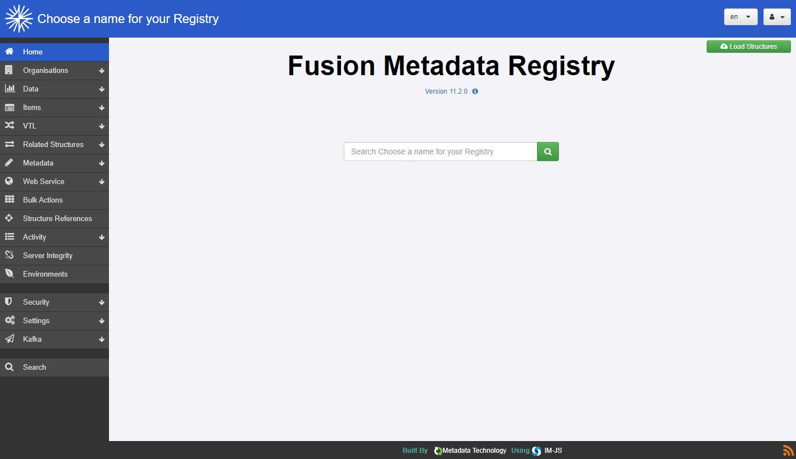
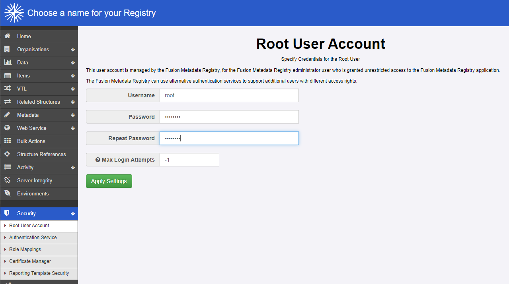

+++
title = "Unit 06 Create and run an FMR Docker container"
description = ""
date = "2022-08-14T00:00:00+00:00"
tags = ["Docker"]
weight= 6
hidden = "true"
disableRightChevron = true
+++

## In this unit
In this final unit  we'll learn how to use Docker command line to pull the image for the latest FMR version, start a running container and begin working with FMR.

## Start an FMR container from Docker command line
Using Docker command line, execute the following commands:

Pull the latest FMR image from Docker Hub:
````
 docker pull metadatatechnology/fmr-mysql:latest
````

This could take a few minutes while **layers** that make up the image are downloaded from Docker Hub.

Create a container called 'fmr':
````
 docker container create --name fmr --publish 8080:8080 metadatatechnology/fmr-mysql:latest
````

The ````--publish 8080:8080```` tells Docker to export the container's internal port 8080 to the host machine using the same port number. When we later come to work with the running FMR, we'll see that the URL references port 8080.

Start the container:
````
 docker start fmr
````
The container will take between one and two minutes to start.

Using a web browser, navigate to: <a href="http://localhost:8080/">http://localhost:8080/</a>

The FMR web user interface will appear when start-up is complete

</img>

The container can be stopped using the following command:
````
 docker stop fmr
````

## Log in to add and maintain metadata, and administer the registry
In the standard Docker image, FMR is configured with a single superuser account called 'root'. 

Logging-in as this account allows the user to:

- Add and maintain structural metadata
- Administer the system and configure the settings

The default credentials are:

Username: root\
Password: password

It's good practice to change the default root password to something more secure inless the container is being used for personal or non-critical testing. Do this from the Security menu choosing 'Root User Account'.

</img>

## Tips and points to note
{}
**Any metadata added to the registry will be persisted in the container.**\
Thus FMR containers can be stopped and restarted as required without loosing any work. 

**Deleting a container will also delete any structural metadata held in its registry.**

**FMR can additionally use an external Microsoft Active Directory or Open LDAP directory service for user authentication allowing other user accounts in addition to the default 'root' account.**\
The procedure for is outside of the scope of this module.
{}

## Recap
- The three Docker command line commands needed to start an FMR container from scratch are:  docker pull, docker container create and docker start
- Use the internal 'root' superuser account to add and maintain structural metadata, administer the system an configure the settings - but change the password from the default for security reasons
- A container can be stopped and restarted without losing its metadata content, but the content will be destroyed if the container is deleted